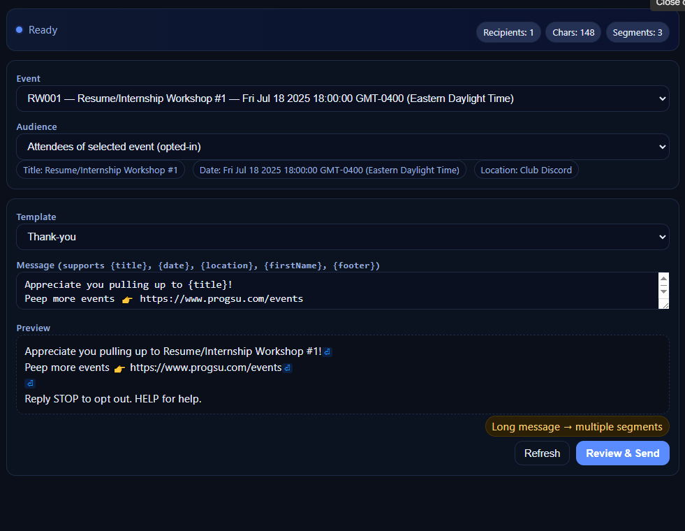

## Twilio SMS for Google Workspace

### Description
This project provides a complete SMS messaging workflow on top of Google Sheets and Google Forms using Google Apps Script and Twilio. It is designed for student organizations and small teams that need to send announcements and reminders to members, target messages to event attendees, maintain opt in status, and keep an auditable log of message activity. The code includes a friendly SMS composer sidebar inside Google Sheets, audience resolution based on event data, access controls, a passcode gate, and rate limiting. Both technical and non technical collaborators can manage messaging safely right from a spreadsheet.

### Features
- Access control using Google account based admin checks
- Optional passcode gate for the sending UI with a twelve hour session
- SMS composer sidebar with templates and live preview that mirrors server rendering
- Message templates with placeholders such as {title} {date} {location} {firstName} and {footer}
- Optional segments in templates for example {date? on {date}} and {location? at {location}}
- Audience targeting for event attendees and for the full opted in member list
- Rate limiting and dry run mode for safe testing
- Centralized SMS logging with retry for failed messages
- **NEW: Production-grade bulk SMS sender** with robust error handling, batch processing, and automatic opt-out management (see below)
- Minimal setup that stays inside your Google Sheet and Twilio account

### 🆕 Bulk SMS Sender (New Feature)

This project now includes a **production-quality bulk SMS sender** (`smsBulkSend.js`) designed for sending messages to large subscriber lists with enterprise-grade error handling.

**Key Capabilities:**
- ✅ **Never crashes** - Continues sending even when individual numbers fail
- ✅ **Error 21610 handling** - Automatically detects and marks opted-out numbers (Twilio STOP/unsubscribe)
- ✅ **Batch processing** - Handles execution time limits with automatic resume capability
- ✅ **Dynamic columns** - Finds columns by name, no hard-coded positions
- ✅ **Rate limiting** - Prevents API throttling
- ✅ **Comprehensive logging** - Per-row status tracking in the sheet

**Quick Start:**
1. Create a sheet named `Subscribers` with columns: `phone`, `opt_in`, `message`, `last_sent_at`, `last_error_code`, `last_error_message`, `last_send_status`
2. Configure Script Properties with Twilio credentials
3. Run `sendBulkSMS()` or use the menu: **📱 Bulk SMS → Send Bulk SMS**

**Documentation:**
- 📄 [Quick Start Guide (5 minutes)](docs/QUICK_START.md) - Get running fast
- 📖 [Complete Setup Guide](docs/BULK_SMS_SETUP.md) - Full documentation
- 🔧 [Technical Reference](docs/ERROR_HANDLING_TECHNICAL.md) - Implementation details

**What makes it production-ready:**
- Uses `muteHttpExceptions` to prevent crashes on Twilio errors
- Robust JSON parsing with fallback error handling
- Immediate opt-out detection and sheet updates when error 21610 occurs
- Cursor-based resume for large lists that exceed execution time limits
- Per-row error tracking without stopping batch execution

### Demo or Screenshots
Screenshots are documented in `docs/ASSETS.md` and embedded below for quick reference


_SMS menu in Google Sheets showing available actions_


_Composer sidebar with event selection, template, preview, and metrics_


_Confirm SMS Send modal with event details, audience, counts, and final message_


_Sent confirmation screen with rendered message preview and summary_


_Project sheets visible as tabs for Student Database, Attendance, Event Log, and SMS Log_


_Student Database sheet with required headers and sample rows_


_Attendance sheet with required headers and sample rows_


_Event Log sheet with headers at row three and sample rows_


_SMS Log sheet with example success and failure entries_


_Apps Script Project Settings showing Script properties configured_

If you add more images, place them in `docs/images/` and update this section accordingly. See `docs/ASSETS.md` for the complete list and capture guidelines

## Installation

### Prerequisites
- A Google account with access to Google Sheets and Google Apps Script
- A Twilio account with an SMS capable phone number
- Node.js and npm if you plan to work locally with clasp which is optional

### Option A  Use the Google Apps Script editor only
1. Create a new Google Sheet and name it for your project
2. Open Extensions then Apps Script to open the bound script editor
3. In the script editor create files matching the names in this repository and paste the contents into each file
   - Create `appsscript.json` via Project Settings then change to the classic editor configuration or copy JSON through the File editor if available
4. Save the project then reload the spreadsheet to register the onOpen menu

### Option B  Use clasp to develop locally and push to Apps Script
1. Install clasp globally

```
npm install -g @google/clasp
```

2. Log in to your Google account in clasp

```
clasp login
```

3. Create a new container bound script for your Google Sheet or use an existing one

```
clasp create --title "Twilio SMS for Google" --type sheets
```

If you already have a bound project, from the Apps Script editor use Project Settings to copy the Script ID then initialize locally

```
clasp clone <YOUR_SCRIPT_ID>
```

4. Copy the repository files into the local clasp folder so the structure matches this project

5. Push code to Apps Script

```
clasp push
```

6. Open the bound Spreadsheet and reload to see the SMS menu

## Usage

### First run
1. Open your Spreadsheet
2. You should see an SMS menu created by the `onOpen` function
3. Click SMS then Open composer to launch the sidebar UI
4. If an admin passcode is configured you will be prompted to unlock

### Typical workflow for a message send
1. Select an Event in the composer sidebar
2. Choose an Audience either attendees of the selected event or all opted in members
3. Pick a Template which will seed the message body
4. Edit the Message body as needed using placeholders
   - {title} inserts the Public Event Title
   - {date} inserts a formatted event date such as Fri, Jul 18 @ 6:00 PM
   - {location} inserts the event location
   - {firstName} will be filled per recipient using the Student Name field in the student database
   - {footer} inserts the standard compliance footer
   - Optional segments can be included with the pattern {key? text that uses {key}}
5. Review the live Preview including segment count which accounts for GSM character limits
6. Click Review and Send to confirm recipients and message length
7. Click Send to dispatch the SMS messages

### Sending a test to yourself
1. Set the `ADMIN_TEST_NUMBER` script property to your phone number in E.164 format for example +15555551234
2. Use SMS then Send test to myself menu item in the Sheet

## Configuration

### Script Properties
Use Apps Script Project Settings then Script properties to configure runtime options

- `SMS_ADMIN_EMAILS`  Comma or space separated list of allowed sender emails. Use a single asterisk to allow any signed in user. Example `owner@example.edu, leader@example.edu`
- `SMS_PANEL_PASS_SHA256`  SHA256 hex digest of the passcode for the sidebar. Create with `setSmsPassFromPlaintext('your pass')` then store the logged hex value
- `SMS_DRY_RUN`  Set to true to log messages without sending through Twilio
- `SMS_RATE_DELAY_MS`  Milliseconds to pause between sends for rate limiting. Default is 150
- `ADMIN_TEST_NUMBER`  E.164 phone number used by the Send test to myself menu action

Additional Twilio properties are defined and read in `sms.js` which is where your low level HTTP call to Twilio should be implemented

- `TWILIO_ACCOUNT_SID`
- `TWILIO_AUTH_TOKEN`
- `TWILIO_FROM_NUMBER`  E.164 number you own in Twilio

### Required Sheets and Columns
Create the following sheets in your Spreadsheet. Header rows are case sensitive

Student Database

```
Student Name | Campus Email | Phone # | SMS Opt-In
```

Attendance

```
Event ID | Campus Email
```

Event Log  headers begin at row 3 in the sheet

```
Event ID | Date (MM/DD/20YY HH:MM AM/PM) | Location | Public Event Title
```

SMS Log  optional though recommended for audit and retries

```
Timestamp | To | Body | HTTP Code | Status | SID | Error
```

The composer reads events from Event Log, counts audience from Attendance and Student Database, and only sends to rows where SMS Opt In equals yes

### Webhooks for inbound SMS  optional
If you plan to support inbound SMS or STOP and HELP handling, implement the handler in `smsInbound.js` and deploy as a Web App. In Twilio set the Messaging webhook for your phone number to the Web App URL for HTTP POST. This step is optional for outbound only use

## Folder Structure

```
Twilio SMS setup with Google/
  appsscript.json           Apps Script project manifest that controls time zone and file visibility
  attendanceSync.js         Helper functions for syncing attendance from Google Forms to the Attendance sheet and related utilities
  sms.js                    Core Twilio integration and helpers such as sendSms_ logSms_ and toE164_ as well as configuration for credentials
  smsInbound.js             Optional inbound webhook for Twilio to receive replies and opt out requests
  smsSend.js                High level features including access control passcode gate templates audience resolution event info lookup and send orchestration
  smsSidebar.html           Sidebar UI for composing previewing confirming and sending messages from inside Google Sheets
  smsBulkSend.js            NEW: Production-grade bulk SMS sender with robust error handling, batch processing, and automatic opt-out detection
  docs/
    QUICK_START.md          5-minute quick start guide for bulk SMS
    BULK_SMS_SETUP.md       Complete setup and usage guide for bulk SMS
    ERROR_HANDLING_TECHNICAL.md  Technical implementation details
    ASSETS.md               Image documentation
```

Key modules

- `smsSend.js` exposes the Sheet menu, RPC functions used by the sidebar, audience resolution, template rendering on the server, and rate limited send orchestration
- `smsSidebar.html` is the front end that runs in the Sheet sidebar with a live preview that matches server rendering
- `sms.js` holds Twilio HTTP calls and shared helpers. You will add your Account SID, Auth Token, and From number as script properties and implement the actual POST to Twilio Messages API in this file
- `attendanceSync.js` can be used to sync Google Form responses into the Attendance sheet if your attendance is collected via a form

## How Google Apps Script fits in
Google Apps Script runs server side JavaScript inside Google Workspace. When bound to a spreadsheet it can add menus and sidebars and can read or write the sheets. This project defines a single `onOpen` entry point that adds an SMS menu for authorized users. The sidebar is an `HtmlService` file that communicates with the server through `google.script.run` calls to functions such as `uiGetEvents` and `uiSend`. All sending is gated by admin checks and an optional passcode that lives in user properties for twelve hours per session

## Twilio integration overview
Twilio sends SMS using a standard HTTPS API. In `sms.js` you will implement a function like `sendSms_(toE164, body)` that performs the HTTP POST to Twilio with Basic Auth using the Account SID and Auth Token. Responses are logged into an SMS Log sheet using `logSms_`. The code in `smsSend.js` already calls these helpers and enforces rate limiting and dry run behavior

## Step by Step Setup

1. Create or open a Google Sheet dedicated to this project
2. Add the sheets named Student Database, Attendance, Event Log, and optionally SMS Log
3. Populate header rows exactly as described in the Configuration section
4. Open Extensions then Apps Script and add the project files
5. In `sms.js` implement Twilio HTTP call and logging helpers if they are not already present
6. Open Project Settings then add Script properties for the values listed under Script Properties
7. In the Apps Script editor run `setSmsPassFromPlaintext('your pass')` from `smsSend.js` to print a SHA256 hex to the log then copy that value into the `SMS_PANEL_PASS_SHA256` property
8. Set `SMS_ADMIN_EMAILS` to the emails that are allowed to use the system. Use an asterisk to allow any signed in user
9. Reload the spreadsheet. You should see the SMS menu. Open the composer sidebar
10. Enter the passcode when prompted. If you did not set a passcode the sidebar opens directly
11. Configure `ADMIN_TEST_NUMBER` and send a test to yourself
12. Add an event row in Event Log, add attendance rows for that event, and ensure the Student Database has phone numbers and SMS Opt In set to yes
13. Use the sidebar to select the event, preview a message, and send to attendees

## Troubleshooting

Admin menu does not appear

- Verify you reloaded the spreadsheet after deploying the script
- Confirm your signed in email is listed in `SMS_ADMIN_EMAILS` or the property is set to asterisk

Sidebar says passcode required

- Make sure you set `SMS_PANEL_PASS_SHA256` to the SHA256 of your passcode using the helper function
- Sessions last twelve hours. Use SMS then Unlock again if your session expired

No recipients or zero count

- Confirm Attendance rows contain the selected Event ID and Campus Email values match exactly with the Student Database sheet
- Confirm Student Database has SMS Opt In value set to yes and has a Phone number present

Sends fail or messages do not arrive

- Check the SMS Log sheet for HTTP Code and error messages
- Confirm your Twilio credentials and From number are correct and that the number is SMS capable
- Validate recipient numbers are in E.164 format for example +15555551234

Images and example screenshots are described in `docs/ASSETS.md`

Rate limiting feels slow

- Adjust `SMS_RATE_DELAY_MS` in Script properties. Use a small value for faster sends though mind provider limits

Dry run mode is on unexpectedly

- Clear or set `SMS_DRY_RUN` to false in Script properties

## Contributing

We welcome contributions from both technical and non technical collaborators

1. Fork the repository
2. Create a feature branch
3. Commit your changes with clear messages
4. Open a pull request with a short description of the change and the motivation

Please follow consistent code style and add or update documentation when you introduce new behavior

## License

Add your preferred license here. MIT is a common choice for open source projects

## Acknowledgments

Google Apps Script and HtmlService for enabling simple UIs inside Sheets
Twilio for the SMS API
All contributors and testers who helped shape the workflow


